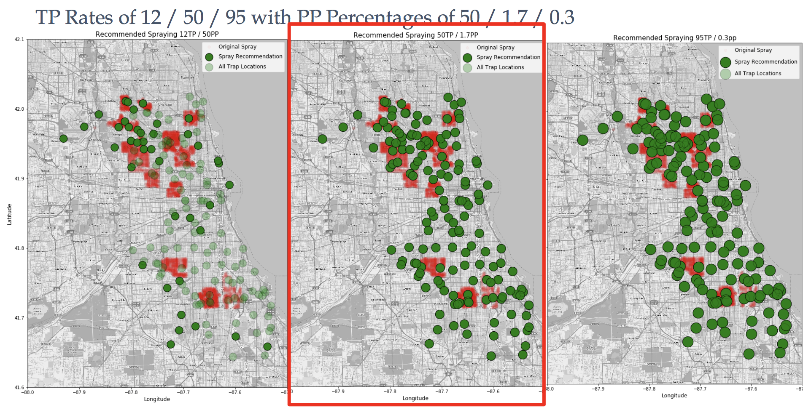

<h1 align="center">DSI Project 4 - Predicting West Nile Virus in Chicago</h1>

_Members: Naman Bhandari, Nguyen Pham, Jon Nelson, James Drabinsky_

---

## Outline

- [Problem statement](#problem-statement)
- [File Structure](#file-structure)
- [Data Dictionary](#data-dictionary)
- [Exploratory Data Analysis](#exploratory-data-analysis)
- [Modeling](#modeling)

---

## Problem Statement

West Nile Virus (WNV) is most commonly spread to humans through infected mosquitoes. About 20% of people who become infected with WNV develop a fever and other symptoms, while 0.6% of infected people develop a serious and sometimes fatal illness. In 2002, the first human cases of WNV were reported in Chicago. By 2004, the City of Chicago implemented a surveillance and control program to prevent WNV that is still in effect today.

In North America, cases of WNV occur during mosquito season, which starts in the late spring and continues through fall. For over a decade, the Chicago Department for Public Health (CDPH) has sprayed insecticide in potentially effected areas.  To inform this process, the CDPH conducts mosquito and bird surveillance operations which includes regularly trapping and collecting mosquitoes for WNV analysis.  

Given weather, training, testing, and spraying data, we will evaluate current spraying approaches and build a model that can predict the presence of WNV in Chicago.  In addition, we will be presenting a cost-benefit analysis assessing the amount of spray needed versus total WNV predicted.  By employing a variety of data science methods, we will construct a  method to predict outbreaks of WNV in mosquito populations that will help the CDPH concentrate mosquito-spraying efforts towards areas that pose the greatest risk, mitigating the potential of another outbreak.

---

## File Structure

- <a href="data">data</a>
- <a href="models">models</a>
- <a href="notebooks">notebooks</a>
- <a href="plots">plots</a>
- <a href="presentation">presentation</a>
- <a href="resources">resources</a>
- [README.md](./README.md)
- [Instructions.md](./instructions.md)

---

## Data Dictionary 

Three data frames were used for this project:

---

### Train: 
- `ID`                       : Dropped
- `Date`                     : Set as index - date that the WNV test is performed - YEAR/MM/DD - Years: 2007 to 2013, odd years
- `Address`   		     : Approximate address returned from GeoCoder
- `Species`                  : 7 Species of Mosquitoes:

    - culex pipiens/restuans
    - culex restuans 
    - culex pipiens 
    - culex other	     : Since there were four species with low value counts, we collapsed those species into one 'other' category.

- `Block`                    : Block number of address
- `Street`                   : Street name
- `Trap`                     : Id of the trap
- `AddressNumberAndStreet`   : Approximate address returned from GeoCoder
- `Latitude`                 : Latitude returned from GeoCoder 
- `Longitude`                : Longitude returned from GeoCoder
- `AddressAccuracy`          : Accuracy returned from GeoCoder
- `NumMosquitos`             : Number of mosquitoes caught in this trap
- `WnvPresent`               : Whether West Nile Virus was present in these mosquitos. 1 means WNV is present, and 0 means not present.
- `Year`		     : With the date as our index, we split the year, month and day into separate columns.
- `Month`
- `Day`

---

### Weather: 

- `Date`           : Set as index
- `Station`        : `1` or `2`
- `Tmax`           : Maximum Temperature 
- `Tmin`           : Minimum Temperature 
- `Tavg`           : (Tmax + Tmin)/2
- `DewPoint`       : Average Dew Points in whole degrees Fahrenheit
- `WetBulb`        : Average Wet Bulb
- `Heat`           : Starts in July 
- `Cool`           : Starts in January
- `Sunrise`        : All from station 1.  Set the sunrise to the same values for station 2
- `Sunset`         : All from station 1.  Set the sunrise to the same values for station 2
- `CodeSum`        : Created dummies - DZ, VCTS, MIFG, VCFG, RA, FU, HZ, TS, BCFG, SQ, TSRA, GR, SN, BR, FG+, FG
- `SnowFall`	   : 1470 missing values, all from station 2
- `PrecipTotal`    : Precipitation
- `StnPressure`    : Pressure in inches of HG
- `SeaLevel`       : Average sea level pressure
- `ResultSpeed`    : Speed of the Vector of the wind. 
- `ResultDir`      : Resultant Direction of the wind in whole degrees
- `AvgSpeed`       : Avg Wind speed
- `Depart`         : Dropped
- `Depth`	   : Dropped
- `Water1`	   : Dropped

---

### Spray:

- `Date` : Set as index - the date the pesticide was sprayed in YEAR/MONTH/DAY.
- `Time` : The time sprayed.
- `Latitude` : The latitude of the location sprayed.
- `Longitude` : The longitude of the location sprayed.

---

## Exploratory Data Analysis

We created a number of different plots to visually inspect our data.  First we used the test data and the probability predictions of each trap containing WNV to plot locations that we recommend mosquito pesticides be sprayed.  We did this in three ways:

- 12 % True Positive Rate (baseline) with 50% Predict Proba Threshold (2014)
- 50 % True Positive Rate with 1.7 % Predict Proba Threshold (2014) (Our recommendation)
- 95 % True Positive Rate with 0.3 % Predict Proba Threshold (2014)

  

To analyze the best time of year to spray mosquito pesticides we summed the predict probability values by date and focused on the most recent year of data we were given (2014). This will display the times of year that have the highest predicted probabilities of WNV.  We identified early September as the ideal spraying time.

  

More plots can be found here: <a href="plots">Plots Folder</a>

---

## Modeling

We evaluated our models by interpreting the trade-off between the false positive rate and the true positive rate (ROC curve). The interpretation of the ROC curve is how many false positives do we need to 'incur' in order to arrive at a sufficiently high true positive rate. This will be determined by the probability threshold above which we believe there to be WNV present in a given trap. Said in another way, each point on the ROC curve represents a false positive rate/true positive rate pair corresponding to a particular decision threshold. The default threshold is 50% -- decreasing it below that (to say 5%) increases your false positives but also increases your true positive rate. 

In our example, a high false positive rate can be thought of as blanketing the whole city with spray. We can't do that obviously (cost of spraying the entire city, health effects of spray, etc.), but we know we need to spray broadly at some level because it is very hard to precisely identify where the virus will be.  If we try to get hyper-specific, we run the risk of missing areas where there is WNV present. In that case, we would minimize false positives, but would also get a lot of false negatives. That is bad, because the virus would spread.

Net-net, you want to overestimate the number of areas with West Nile and spray there. You must do a cost-benefit analysis on this.

| Model                   | ROC-AUC Score
|-------------------------|---------------
| Random Forest           |    0.79 
| Random Forest w/ SVD    |    0.63      
| Logistic Regression     |    0.73       
| AdaBoost                |    0.80       
| GradientBoost           |    0.81  
